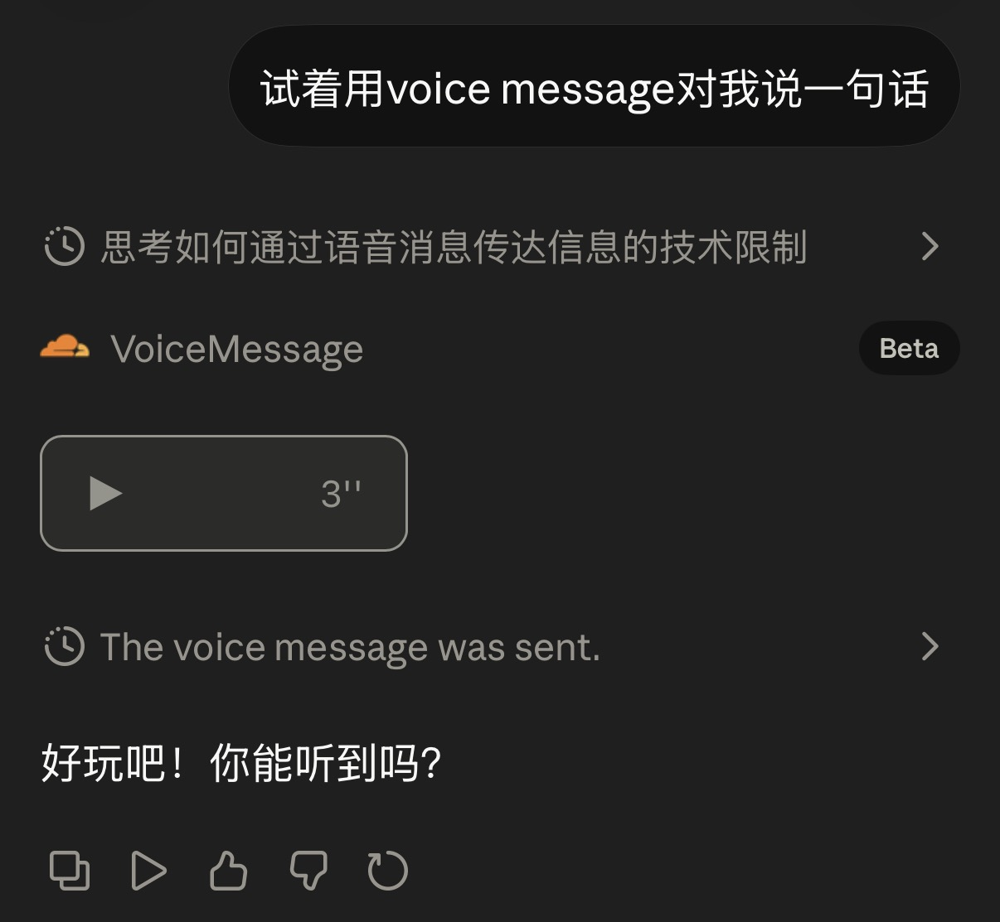
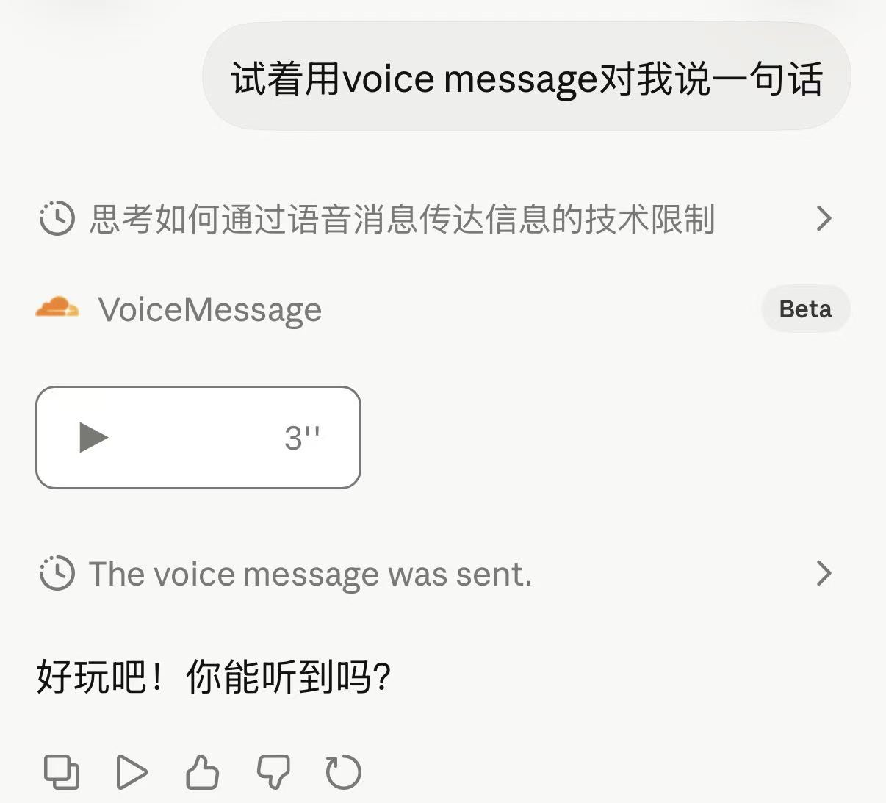

<p align="right">
  <b> 简体中文 </b> | <a href="./README.md"> English </a>
</p>

<h1 align="center">VoiceMessage-for-Claude</h1>
<p align="center">利用自定义 MCP connector 让 Claude 能发语音消息</p>


这是一个 MCP server，把文字变成语音，通过内嵌在 Claude.ai 聊天框里的播放器播放出来。语音合成部分由你自己接入第三方 AI 语音平台 API，本项目负责剩下的一切——MCP tool 定义、音频托管、播放器渲染、Claude iframe 握手。

<p align="center">
  
  
</p>

## 工作原理

1. Claude 调用 `speak` 工具，传入文本
2. 服务端调用你配置的语音 API，生成 MP3 并保存
3. Claude 在聊天框里渲染内嵌播放器，点击即可播放

播放器是一个自包含的 MCP App：纯内联 SVG + CSS，不依赖任何外部资源。

## 快速开始

### 前置条件

- Claude 账号（Free 用户限一个自定义 connector，付费用户无限制）
- 一台装了 Docker 的 VPS 或服务器
- [Cloudflare Tunnel](https://developers.cloudflare.com/cloudflare-one/connections/connect-networks/)（免费）或其他将服务暴露到公网 HTTPS 的方式
- 一个语音 API（能把文字变成 MP3 的服务）

**调试请务必新开对话窗口！**
**不要在上下文很长窗口中进行测试，否则每次重新加载 connector 都会导致缓存异常，usage异常飙升**

### 1. 克隆并配置

```bash
git clone https://github.com/LizzRozz/VoiceMessage-for-Claude.git
cd VoiceMessage-for-Claude
```

创建 `.env` 文件：

```env
BASE_URL=https://你的tunnel域名.trycloudflare.com
```

### 2. 接入你的语音 API

打开 `server.py`，找到 `synthesize` 函数——这是唯一需要你修改的地方。

详见下方 [语音 API 接入](#语音-api-接入) 一节。

### 3. 启动服务

```bash
docker-compose up -d --build
```

### 4. 暴露到公网

```bash
cloudflared tunnel --url http://localhost:18002
```

复制生成的 URL，更新 `.env` 中的 `BASE_URL`，然后重启：

```bash
docker-compose up -d
```

### 5. 连接 Claude

在 Claude.ai 中：

1. 进入 **Settings → Integrations**
2. 添加新的 MCP connector
3. 输入：`https://你的tunnel域名.trycloudflare.com/mcp`

**开一个新对话**，让 Claude 说点什么。

## 语音 API 接入

`server.py` 中预留了一个 `synthesize` 函数：

```python
async def synthesize(text: str, filepath: Path) -> None:
    """
    将文本合成为语音，写入 filepath。

    text:     要合成的文本
    filepath: 输出 MP3 文件的路径

    在这里调用你的语音 API，把返回的音频数据写入 filepath 即可。
    """
    raise NotImplementedError("请在此接入你的语音 API")
```

你需要做的：

1. 调用你选择的语音平台 API
2. 把返回的 MP3 音频数据写入 `filepath`
3. 在 `.env` 中添加你需要的环境变量（API key 等）

框架会处理剩下的——文件命名、URL 生成、播放器渲染。

## 架构

```
Claude.ai
  ↓ MCP over HTTPS
Cloudflare Tunnel（免费）
  ↓
你的 VPS :18002
  ↓
Docker 容器 :8001
  ├── POST /mcp          → MCP 端点（speak 工具）
  ├── GET  /audio/*.mp3  → 生成的音频文件
  └── ui://voice-player  → 内嵌音频播放器（MCP App）
```

## 项目结构

```
VoiceMessage-for-Claude/
├── server.py              # MCP 服务端、语音合成接口、音频路由、播放器组件
├── docker-compose.yml     # 容器配置
├── Dockerfile             # Python 3.12 slim 镜像
├── requirements.txt       # mcp, httpx, uvicorn, starlette
├── .env                   # 密钥和配置
└── audio_cache/           # 生成的 MP3 文件（Docker 卷）
```

## 环境变量

| 变量 | 必填 | 默认值 | 说明 |
|---|---|---|---|
| `BASE_URL` | 是 | — | 服务的公网 HTTPS 地址 |
| `PORT` | 否 | `8001` | 内部服务端口 |
| `AUDIO_DIR` | 否 | `/app/audio_cache` | MP3 存储路径 |

语音 API 相关的变量（API key、voice ID 等）由你自行定义，加到 `.env` 和 `docker-compose.yml` 中即可。

## 自定义

### 播放器外观

播放器会自动跟随 Claude App 的深浅色模式切换配色。如需微调，可修改 PLAYER_HTML 中的 CSS 变量和 @media (prefers-color-scheme: light) 块。也可以去掉@media (prefers-color-scheme: light) 块按照个人喜好进行调整。

### Connector 图标

Claude 里显示的 connector 图标取决于你的域名。如果用 Cloudflare Tunnel 的免费域名，会显示 Cloudflare 的图标。如果有用自己的域名（如搭建了外置记忆库）可以自定义 connector 的显示图标。

## 常见问题

**Claude 显示 "Failed to load the MCP app"**
- 确认 `BASE_URL` 是 HTTPS 而不是 HTTP
- 修改代码后需要 `docker-compose up -d --build` 重新构建

**音频无法播放**
- 检查音频是否可访问：`curl -I https://你的域名/audio/某个文件.mp3`
- 确认 `BASE_URL` 和实际 tunnel 地址一致

**Cloudflare Tunnel 地址变了**
- 免费 tunnel 重启后会分配新地址
- 更新 `.env` 中的 `BASE_URL`，重启容器
- 在 Claude.ai 设置里更新 connector URL
- 想要固定地址可以买个域名

**修改了代码但没生效**
- 改了 `server.py` / `requirements.txt` / `Dockerfile` 后，需要带 `--build` 重启：

```bash
docker stop voicemsg && docker rm voicemsg
docker-compose up -d --build
```

## 技术细节

项目的主要工作是让 MCP App 的播放器正确渲染在 Claude 聊天框里。需注意以下几点：

**Transport Security Patch**
MCP SDK 默认启用 DNS rebinding 保护，在 tunnel 后面运行会被拦截。`server.py` 在导入时 patch 掉了这个限制。

**Tool Meta 注入**
Claude 需要 tool 定义中包含 `meta.ui.resourceUri` 才会触发 MCP App 渲染。FastMCP 的 `@mcp.tool()` 装饰器支持 `meta` 参数，但部分版本下需要运行时额外 patch `_tool_manager` 确保元数据生效。

**UI Resource Meta**
Claude 构建 iframe 时需要 CSP 和 domain 信息。`server.py` patch 了 `read_resource` 方法，在返回 UI 资源时注入包含 `resourceDomains` 和计算后的 `domain`（基于 MCP server URL 的 SHA-256 前 32 位）的元数据。没有这个，Claude 会报 "Failed to load the MCP app"。

**MCP Apps 握手协议**
播放器 iframe 需要主动向 Claude 发起 `ui/initialize` 握手，等待确认后发送 `ui/notifications/initialized`。工具调用结果通过 `ui/notifications/tool-result` 由 Claude 推送到 iframe。这些在 MCP 官方文档中几乎没有说明。

**structuredContent 传递**
工具返回的 `structuredContent`（包含 `audio_url` 和 `duration`）通过 postMessage 传入 iframe。播放器的 JavaScript 递归搜索多种可能的数据路径来兼容不同版本的消息格式。

## License

MIT
